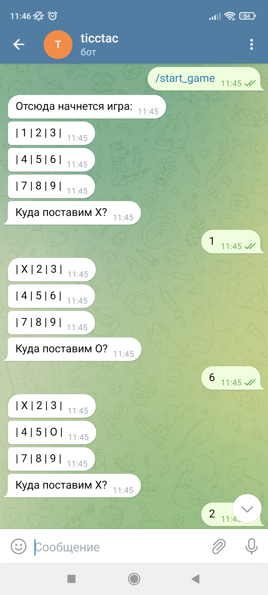

Перед вами игра крестики нолики на двух человек, первым начинает Х , затем О. Тот кто первым закроет поле по горизонтали, вертикали или диагонали - поебедил.  
  Программа состоит из 3 модулей. Перед там как запустить прграмму в интерпритаторе не обходимо установить req.txt
**Моудль main** - запукает игру и подключает bot.log .  
**Модуль game** - проверяет на победу, проигрыш или ничью, а так же занято место или свободно.  
**Модуль utils** - игровое поле.  
    Для запуска бота нужно написать /start.

